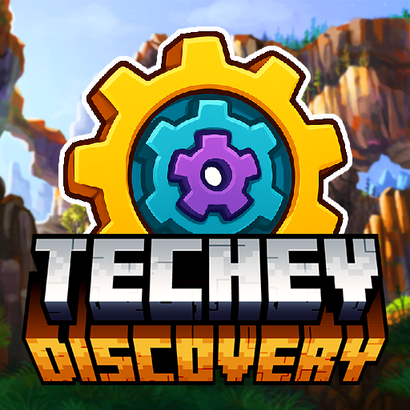

<!-- Badges -->

  
  

<!-- Logo + Title -->
<table>
  <tr>
    <td>
      
    </td>
    <td>
      <h1>TechEv || Discovery</h1>
      
<strong>Version:</strong> 1.19.2

      
<strong>Genre:</strong> Minecraft Modpack - Tech, Magic, Quests, Exploration

      
<strong>Author:</strong> SanoLink

    </td>
  </tr>
</table>

---

### 🚀 Overview

**TechEv || Discovery** is a Minecraft 1.19.2 modpack combining **advanced technology**, **mystical magic**, **guided progression**, and **immersive exploration**.

Every element has been carefully crafted to deliver a smooth and rewarding experience — from custom recipes and mod integrations to unique mechanics and hidden secrets across multiple dimensions.

---

### ✨ Key Features

- 🔧 **High-Tech Systems** with deep mod integration
- 🧙‍♂️ **Balanced Magic** and rituals
- 🌍 **Custom Exploration** (dimensions, biomes, structures)
- 📜 **Progressive Questing** with themed chapters
- 🛠️ **Customized Crafting & Recipes**
- 🎯 **Final Goal:** Master the legendary energy of **TechEv**

---

### 📦 Installation

1. Download from [CurseForge](https://www.curseforge.com/minecraft/modpacks/techevdiscovery)
2. Start your journey!

---

### 👨‍💻 Developed by

**SanoLink**  

> ⭐ Suggestions, ideas, and contributions are welcome on GitHub!

---

### 🔗 Useful Links 

- 💬 [Join the Community Discord](https://discord.gg/CdeTXFYXgK)
- 🛠️ [GitHub Repository](https://github.com/SanoLink/TechEvDiscovery)
- 📦 [CurseForge Page](https://www.curseforge.com/minecraft/modpacks/techevdiscovery)

---

### ⚙️ Requirements

- Minecraft Version: `1.19.2`
- Minimum RAM: `6 GB`
- Forge : `43.5.0`
