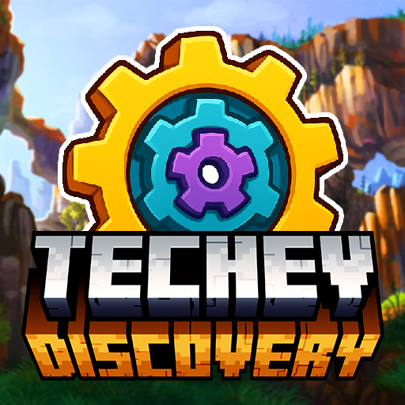

<!-- Badges -->

  
  

<!-- Logo + Title -->
<table>
  <tr>
    <td>
      
    </td>
    <td>
      <h1>TechEv || Discovery</h1>
      
<strong>Version:</strong> 1.19.2

      
<strong>Genre:</strong> Minecraft Modpack - Tech, Magic, Quests, Exploration

      
<strong>Author:</strong> SanoLink

    </td>
  </tr>
</table>

---

### 🚀 Overview

**TechEv || Discovery** is a Minecraft 1.19.2 modpack combining **advanced technology**, **mystical magic**, **guided progression**, and **immersive exploration**.

Every element has been carefully crafted to deliver a smooth and rewarding experience — from custom recipes and mod integrations to unique mechanics and hidden secrets across multiple dimensions.

---

### ✨ Key Features

- 🔧 **High-Tech Systems** with deep mod integration
- 🧙‍♂️ **Balanced Magic** and rituals
- 🌍 **Custom Exploration** (dimensions, biomes, structures)
- 📜 **Progressive Questing** with themed chapters
- 🛠️ **Customized Crafting & Recipes**
- 🎯 **Final Goal:** Master the legendary energy of **TechEv**

---

### 📦 Installation

Pick the option that fits you best:

#### 🟢 Easy — CurseForge *(recommended for players)*

1. Download from [CurseForge](https://www.curseforge.com/minecraft/modpacks/techevdiscovery)
2. Start your journey!

#### 🟡 Experienced — GitHub Release *(latest released build)*

1. Download the latest release from the [Releases page](https://github.com/SanoLink/TechEvDiscovery/releases) and extract it.
2. Fetch all mods automatically:
   - **Windows:** double-click `setup/mods_sync.bat`
   - **Linux / macOS:** run `sh setup/mods_sync.sh`

   > First run downloads a few hundred MB of mods — let it finish.
3. In your launcher (CurseForge, Prism, MultiMC…), create a **1.19.2 + Forge 43.5.0** profile pointing at this folder, then launch.

#### 🔴 Developer — Git *(unreleased / in-development versions)*

1. Clone the repo: `git clone https://github.com/SanoLink/TechEvDiscovery.git`
2. Switch to the branch you want (e.g. `git checkout 1.6.0`).
3. Run it once — Windows: double-click `setup/mods_sync.bat`, Linux/macOS: `sh setup/mods_sync.sh`. It installs the git hooks **and** fetches the mods. After that, every `git pull` or branch `checkout` re-syncs your mods automatically.
4. Set up a **1.19.2 + Forge 43.5.0** profile in your launcher as above.

---

### 👨‍💻 Developed by

**SanoLink**  

> ⭐ Suggestions, ideas, and contributions are welcome on GitHub!

---

### 🔗 Useful Links 

- 💬 [Join the Community Discord](https://discord.gg/CdeTXFYXgK)
- 🛠️ [GitHub Repository](https://github.com/SanoLink/TechEvDiscovery)
- 📦 [CurseForge Page](https://www.curseforge.com/minecraft/modpacks/techevdiscovery)
- 📋 [Full Mod List](MODLIST.md)

---

### ⚙️ Requirements

- Minecraft Version: `1.19.2`
- Forge: `43.5.0`
- Java: `17+` *(bundled by most launchers)*
- Minimum RAM: `6 GB`
